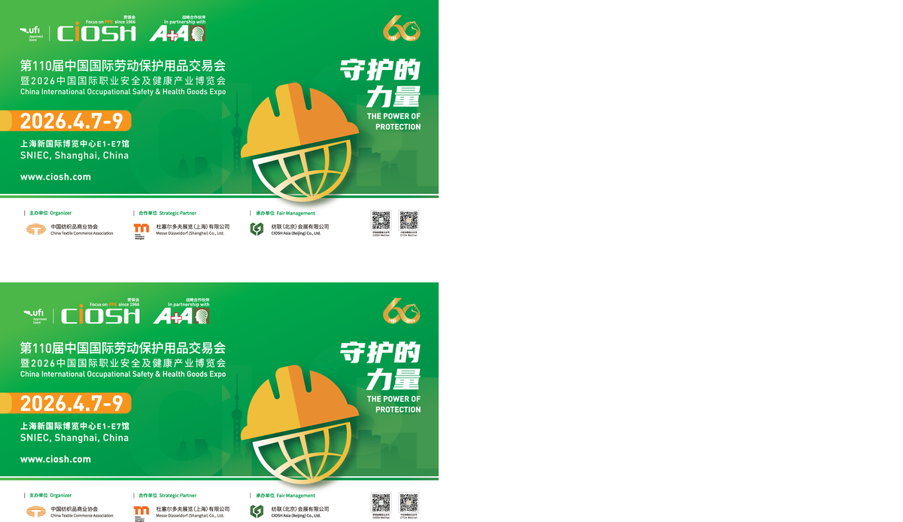

# CIOSH 劳保展 · 第二曲线项目

> 中国国际劳动保护用品交易会（CIOSH）数字化转型与战略陪跑项目。
> 主色：█ #009748 绿 · █ #f39700 橙

---

## 项目背景

CIOSH 是中国最大的 PPE（个人防护装备）展会，由**杜塞尔多夫展览（上海）有限公司（MDS）**与中国纺织品商业协会合资运营。

项目当前处于稳定/瓶颈期，核心问题：**展商品类过度单一**，全部集中在低级别 PPE 产品（手套/劳保服/防护面具/面料），需要"第二曲线"为展会创造新的落脚点与架构。

目标年度：**2027** 拓展出新的业务体（新展区 / 新展商 / 新展团 / 新观众）。

## 仓库内容

| 目录/文件 | 说明 |
|---|---|
| `Agent.md` | 项目身份卡，所有 Agent 进入项目的必读文件 |
| `Branding/` | CIOSH 品牌视觉文件（AI/EPS 源文件 + 输出图） |
| `ciosh-demo/` | CIOSH 品类渗透引擎 Demo 原型 |
| `as_is_manual_file/` | 现场原始文件（Excel/PDF 合同/数据报告） |
| `csv_export_for_excel/` | 结构化导出的展会数据 |
| `output/` | 分析报告与 PPT 产出 |
| `*.md` | 各阶段分析报告（S04-S08） |

## 转型目标

- **新展区**：突破单一 PPE 品类
- **新展商**：从自媒体信号中捕获采购需求，反向匹配展商
- **新展团**：建立跨品类展商联盟
- **新观众**：结构性增加，而非数量堆叠

## 推进方式

- 节奏：1 年长期陪跑
- 方法：数字化转型 + 战略陪跑
- 打法：逐个点位击破，不做大而全的方案

---

*MDS Shanghai · BD 总监 Max · 2026*
